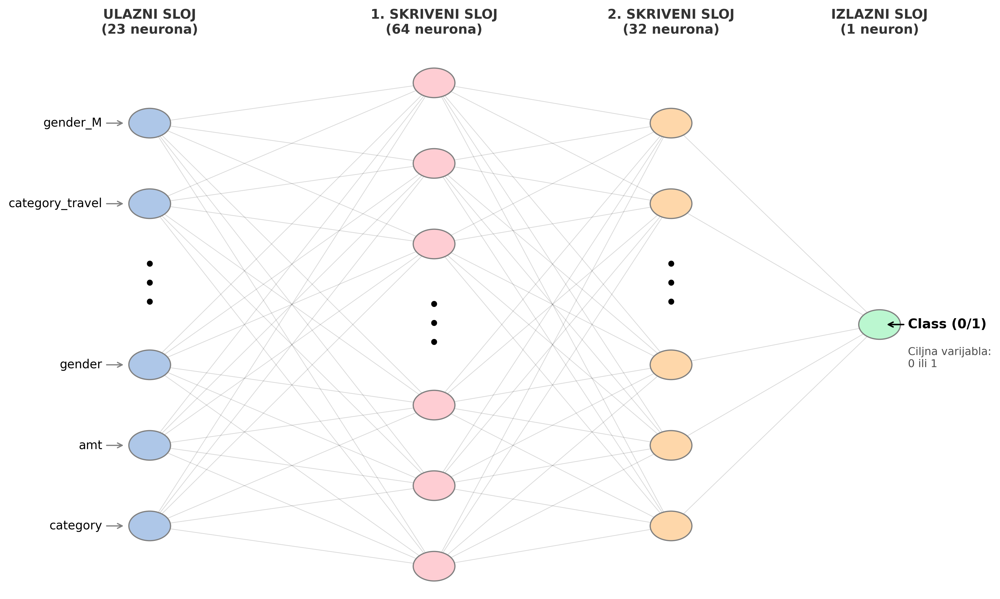

# Primena neuronskih mreža za predvidjanje prevara u finansijama (credit card fraud)

**1. Opis problema**

Danas skoro svi koristimo kreditne kartice za plaćanja, od kupovine namirnica do plaćanja računa. Kako se svet seli na internet, tako nažalost raste i broj prevara. Prevaranti više ne biraju gde će napasti – od malih radnji do velikih banaka, svi su na meti. Zbog toga je postalo presudno da imamo sisteme koji mogu brzo i precizno da prepoznaju kada nešto nije u redu.

Cilj ovog projekta je da napravimo sistem koji će "uhvatiti" prevaru pre nego što se transakcija uopšte odobri. Trebalo bi da omogući da u trenutku kada korisnik prisloni karticu na terminal (ili odradi online transakciju), sistem za delić sekunde mora da odluči – da li je sve u redu ili neko pokušava da ti ukrade novac (izvrši bilo kakvu nedozvoljenu radnju). Ako sistem posumnja na prevaru, transakcija se odmah blokira, a ako je sve čisto, novac prolazi.

Najveći problem ovde je što je prevara jako malo u odnosu na normalne kupovine. ako imamo 1000 transakcija, a samo par njih su prevare. Ako bi sistem bio "lenj", mogao bi samo da kaže da je sve normalno i bio bi u pravu u 99% slučajeva, ali bi propustio one ključne prevare koje nam trebaju. Tu obični algoritmi često greše, pa smo se zato okrenuli veštačkim neuronskim mrežama. Neuronske mreže mogu da nauče i najsitnije, skrivene detalje koji razlikuju običnu kupovinu od one sumnjive.

U ovom radu sam se fokusirao na to kako da naučimo neuronsku mrežu da prepozna te prevare. Pored samog pravljenja modela, mnogo sam pažnje posvetio i pripremi podataka, jer ako podaci nisu dobro sređeni, ni najbolji algoritam ne može da radi kako treba. Na kraju, cilj mi je bio da napravim model koji zaista može da razlikuje prevaru od poštene transakcije, uzimajući u obzir i rizik da se greškom blokira kartica nekome ko samo želi da plati svoj račun.

**2. Podaci**

Izvor i struktura

Dataset korišćen u ovom projektu preuzet je sa platforme Kaggle (dataset preuzet sa: https://www.kaggle.com/datasets/kartik2112/fraud-detection
). Originalni skup sadrži preko 1.500.000 transakcija, a za potrebe ovog projekta izdvojen je reprezentativan podskup od 200.000 transakcija. Svaka transakcija sadrži 23 obeležja koja opisuju različite aspekte plaćanja, uključujući podatke o korisniku (npr. pol, zanimanje, lokacija), detalje o trgovcu i same karakteristike transakcije (iznos, vreme).

Analiza, čišćenje i preprocesiranje

Pre obučavanja modela, podaci su prošli kroz rigorozan proces pripreme:

Selekcija i inženjering obeležja: Iz originalnog skupa izdvojene su relevantne kolone, dok su redundantne informacije uklonjene kako bi se smanjila dimenzionalnost. Posebna pažnja posvećena je kategoričkim podacima (poput kategorije trgovca ili pola korisnika) – nad njima je primenjena one-hot enkoding metoda (get_dummies), čime su kategorije pretvorene u numeričke kolone pogodne za rad neuronske mreže.

Testiranje normalnosti: Sproveden je Shapiro-Wilk test nad svim obeležjima. Rezultati su pokazali da nijedna varijabla ne prati normalnu raspodelu, odnosno da postoji određen broj autlajera (npr. u koloni amount)

Skaliranje podataka: Zbog osetljivosti na autlajere, izbegnut je StandardScaler. Primenjen je RobustScaler, koji koristi medijanu i interkvartilni opseg, čime je postignuta stabilnost modela čak i pri velikim finansijskim oscilacijama.

Podela skupa: Podaci su podeljeni na trening i test skup u odnosu 80/20. Korišćena je stratifikovana podela, čime je osigurano da procenat prevara (0.82%) bude identičan u oba skupa, što je preduslov za realnu procenu performansi modela.

**3. Arhitektura modela**

Za potrebe binarne klasifikacije transakcija, implementirana je Feedforward neuronska mreža (Multilayer Perceptron). Model je dizajniran tako da postigne balans između sposobnosti učenja kompleksnih obrazaca i otpornosti na pretreniranost (overfitting).

Arhitektura mreže se sastoji od:

Ulazni sloj: Prima 23 ulazna obeležja koja opisuju transakciju.

Skriveni slojevi: Mreža sadrži dva skrivena sloja sa 64, odnosno 32 neurona. Izbor ReLU aktivacione funkcije omogućava mreži uvođenje nelinearnosti, što je ključno za detekciju skrivenih anomalija u podacima.

Regularizacija (Dropout): U svakom sloju primenjen je Dropout mehanizam, koji nasumično "gasi" deo neurona tokom treninga. Ovo primorava mrežu da ne postane zavisna od pojedinačnih neurona, čime se značajno smanjuje rizik od pamćenja šuma iz podataka umesto učenja pravih šablona prevara.

Izlazni sloj: Jedan neuron koji daje sirovi izlazni signal (logit), koji se kasnije pomoću Sigmoid funkcije mapira u verovatnoću pripadnosti klasi prevare.

Za obučavanje modela korišćena je BCEWithLogitsLoss funkcija greške (pogodna za numeričku stabilnost kod binarnih problema) i Adam optimizator sa stopom učenja (learning rate) od 0.001.

**4. Trening**

Proces obučavanja neuronske mreže sproveden je kroz dve kontrolisane faze kako bi se eksperimentalno analiziralo ponašanje modela i sprečilo pretreniranost (overfitting). Za optimizaciju težina korišćen je Adam optimizator sa stopom učenja (learning rate) od 0.001, dok je funkcija greške bila BCEWithLogitsLoss. Podaci su procesirani u mini-serijama (mini-batches).

Faza 1: Trening bez Early Stopping mehanizma 
U prvoj fazi model je namerno obučavan kroz maksimalnih 50 epoha bez ikakvih restrikcija. Cilj ove faze bio je vizuelna i statistička analiza krive gubitka. Dok je trening gubitak (Train Loss) konstantno opadao do vrednosti 0.0121, validacioni gubitak (Val Loss) je nakon 25. epohe počeo da stagnira i blago osciluje (npr. skokovi na 0.0132 u 44. epohi). Ovo ponašanje je potvrdilo da mreža nakon te tačke počinje da pamti specifičnosti trening skupa umesto da uči opšte obrasce, što je pružilo jasan dokaz da nam nije neophodno svih 50 epoha kako bi dobili najbolji model već uvođenjem algoritma opisanog u fazi 2 nalazimo brže optimalno rešenje.

Faza 2: Trening sa Early Stopping mehanizmom (Konačni model)
Za potrebe finalnog modela implementirana je prilagođena klasa EarlyStopping sa parametrom patience=10 (broj epoha koje model sme da provede bez napretka pre nego što se trening prekine) i minimalnim pragom poboljšanja delta=0.0001.

Tok konvergencije: Trening je uspešno i automatski prekinut u 35. epohi, jer model u prethodnih 10 uzastopnih iteracija nije uspeo značajnije da smanji grešku na validacionim podacima.

Čuvanje najboljeg modela: Optimalne težine modela automatski su detektovane i sačuvane u 25. epohi, gde je ostvaren minimalni validacioni gubitak od 0.0124. Ove težine su uspešno učitane natrag u model pre finalne evaluacije.

**5. Hiperparametarska optimizacija**

Kako bi se pronašla optimalna konfiguracija modela za stabilnu detekciju prevara, sprovedena je sistematska hiperparametarska optimizacija. Kreiran je automatizovani eksperimentalni pipeline (train_model) koji omogućava testiranje različitih arhitektura i parametara u identičnim početnim uslovima (torch.manual_seed(42)), uz aktiviran Early Stopping mehanizam.Testirano je ukupno 8 različitih konfiguracija kroz varijacije tri ključna faktora: kapaciteta mreže (broj skrivenih neurona), intenziteta regularizacije (Dropout rate) i brzine učenja (Learning Rate)

| Konfiguracija | Skriveni slojevi (Hidden) | Dropout stopa | Brzina učenja (LR) | Najbolji Val Loss | Epohe do zaustavljanja | Vreme izvršavanja (s) |
| :--- | :---: | :---: | :---: | :---: | :---: | :---: |
| **Manji Dropout** | (64, 32) | 0.1 | 0.0010 | **0.0110** | 42 | 354.5 |
| **Veća mreža** | (128, 64) | 0.3 | 0.0010 | **0.0116** | 29 | 442.9 |
| **Kombinovano najbolje** | (128, 64) | 0.1 | 0.0010 | **0.0119** | 20 | 179.9 |
| **Baseline (trenutna)** | (64, 32) | 0.3 | 0.0010 | **0.0124** | 35 | 283.0 |
| **Manja mreža** | (32, 16) | 0.3 | 0.0010 | **0.0133** | 50 | 444.6 |
| **Veći Dropout** | (64, 32) | 0.5 | 0.0010 | **0.0138** | 50 | 441.4 |
| **Manji learning rate** | (64, 32) | 0.3 | 0.0001 | **0.0146** | 50 | 371.8 |
| **Veći learning rate** | (64, 32) | 0.3 | 0.0100 | **0.0221** | 17 | 132.9 |

Ključni zaključci i analitički uvid

Analiza dobijenih rezultata pruža duboko razumevanje ponašanja neuronske mreže na ovom skupu podataka:

Uticaj regularizacije (Dropout): Konfiguracija sa smanjenom stopom dropout-a na 0.1 ostvarila je apsolutno najbolji rezultat (Val Loss: 0.0110). Ovo ukazuje na to da je početna stopa od 0.3 bila previše agresivna i da je potiskivala kapacitet mreže da nauči fine, suptilne obrasce finansijskih anomalija. Sa druge strane, podizanje dropout-a na 0.5 drastično je pokvarilo model, dovodeći do sporije konvergencije (maksimalnih 50 epoha) i lošijeg rezultata (0.0138).

Kapacitet mreže (Širina slojeva): Proširenje mreže na konfiguraciju (128, 64) pokazalo se kao izuzetno efikasno. Model je postigao sjajan gubitak od 0.0116 i konvergirao znatno brže (za samo 29 epoha u poređenju sa 35 kod baseline-a). To dokazuje da je kompleksnijim finansijskim podacima potreban širi prostor obeležja za uspešnu separaciju klasa. Smanjenje mreže na (32, 16) je očekivano podbacilo.

Ukrštanje parametara (Kombinovano najbolje): Eksperiment u kojem su spojena dva pojedinačna poboljšanja (šira mreža + manji dropout) je testiran kako bismo videli da li ćemo dobiti još bolji rezultat. Iako ovaj model nije uspeo da nadmaši verziju sa manjim dropout-om, on je pokazao ekstremnu efikasnost. Konvergirao je u ubjedljivo najkraćem roku – za samo 20 epoha i 179.9 sekundi, postižući vrhunski Val Loss od 0.0119. Ovo ga čini odličnim kandidatom za sisteme gde je brzina obučavanja kritičan faktor.

Osetljivost na brzinu učenja (Learning Rate): Vrednost od 0.001 se pokazala kao idealna. Povećanje na 0.01 je potpuno destabilizovalo optimizaciju (najgori Val Loss od 0.0221), dok je smanjenje na 0.0001 previše usporilo mrežu, ostavljajući je nekonvergiranom nakon 50 epoha.

### 6. Rezultati evaluacije

Finalni model (hidden_sizes=(64,32), dropout=0.1, lr=0.001) evaluiran je na test skupu od 40.000 transakcija koje model NIJE video tokom treninga ni validacije. Od 40.000 transakcija, 39.671 je legitimnih i 329 je fraud (0.823%), što odražava stvarnu distribuciju iz originalnog dataseta (zahvaljujući stratifikovanoj podeli).

#### 6.1 Tačnost i osnovna klasifikacija (prag = 0.5)

Ukupna tačnost modela iznosi **99.73%**. Međutim, sama tačnost je varljiva metrika za izrazito neravnomerne datasete — model koji bi UVEK predviđao "legitimna transakcija" bez ikakvog učenja bi postigao tačnost od 99.18%, što je tek neznatno niže. Iz tog razloga, evaluacija se fokusira na metrike specifične za klasu "Prevara".

#### 6.2 Matrica konfuzije (prag = 0.5)

| | Predviđeno: Legitimna | Predviđeno: Prevara |
| :--- | :--- | :--- |
| **Stvarno: Legitimna** | TN = 39.643 | FP = 28 |
| **Stvarno: Prevara** | FN = 79 | TP = 250 |

Model je ispravno klasifikovao 250 od 329 fraud transakcija (Recall = 76.0%) uz samo 28 lažnih uzbuna od 39.671 legitimnih transakcija.

**Ključne metrike za klasu "Prevara":**
* **Precision = 0.8993** — kada model prijavi fraud, u 89.9% slučajeva to JE stvarni fraud. Veoma nizak broj lažnih uzbuna.
* **Recall = 0.7599** — model hvata 76.0% svih stvarnih fraud transakcija. 79 fraud transakcija (24.0%) prolazi nedetektovano.
* **F1-score = 0.8237** — harmonijska sredina Precision-a i Recall-a.

#### 6.3 ROC-AUC i Precision-Recall AUC

* **ROC-AUC = 0.9900** — model skoro uvek rangira fraud transakciju iznad legitimne kada ih poredi. Vrednost bliska 1.0 ukazuje na izvanrednu sposobnost razlikovanja dve klase.
* **PR-AUC = 0.8421** — za referencu, nasumičan model bi postigao PR-AUC = 0.0082 (jednak udelu fraud-a u datasetu). Naš model je 103 puta bolji od nasumičnog, što potvrđuje da je naučio statistički značajne obrasce koji razlikuju fraud od legitimnih transakcija. 

PR-AUC je posebno relevantna metrika za neravnomerne datasete jer ne uzima u obzir True Negatives (kojih ima 39.643, odnosno skoro ceo dataset). Vrednost od 0.8421 je izuzetna za problem gde pozitivna klasa čini svega 0.82% podataka.

#### 6.4 Analiza praga klasifikacije (Threshold Tuning)

Standardni prag od 0.5 (model mora biti više od 50% siguran da je fraud) nije nužno optimalan za sve primene. U bankarskom kontekstu, cena PROPUŠTENE prevare (finansijski gubitak korisnika i banke) generalno je veća od cene LAŽNE UZBUNE (privremena neugodnost korisnika koja se brzo rešava). Ova asimetrija motiviše ispitivanje nižih pragova:

| Prag | TP | FP | FN | Precision | Recall | F1 |
| :---: | :---: | :---: | :---: | :---: | :---: | :---: |
| 0.1 | 282 | 322 | 47 | 0.467 | 0.857 | 0.605 |
| 0.2 | 271 | 121 | 58 | 0.691 | 0.824 | 0.752 |
| **0.3** | **262** | **70** | **67** | **0.789** | **0.796** | **0.793** |
| 0.4 | 255 | 46 | 74 | 0.847 | 0.775 | 0.810 |
| 0.5 | 250 | 28 | 79 | 0.899 | 0.760 | 0.824 |
| 0.6 | 237 | 20 | 92 | 0.922 | 0.720 | 0.809 |
| 0.7 | 197 | 16 | 132 | 0.925 | 0.599 | 0.727 |

Između praga 0.5 i 0.6, Precision raste sa 0.899 na 0.922, ali Recall pada sa 0.760 na 0.720 — 13 više propuštenih prevara uz samo 8 manje lažnih uzbuna. U bankarskom kontekstu ova zamena nije isplativa. Sa druge strane, prag 0.5 postiže najbolji F1-score (0.824) od svih isprobanih pragova.

**Preporučeni prag za bankarsku primenu: 0.3**

Sa pragom 0.3, model hvata 262 od 329 fraud transakcija (Recall = 79.6%) uz 70 lažnih uzbuna. U poređenju sa standardnim pragom 0.5, hvata se 12 dodatnih prevara uz porast lažnih uzbuna sa 28 na 70. Prag 0.1 postiže najviši Recall (85.7%) ali uz 322 lažne uzbune — previše za praktičnu primenu.

Konačan izbor praga u produkcijskom sistemu zavisio bi od konkretne poslovne politike banke i definisanog odnosa prihvatljivih troškova FP i FN grešaka.

**7. Diskusija**

Razvijeni model feedforward neuronske mreže postigao je izuzetne performanse, što potvrđuje da duboko učenje može uspešno da izoluje obrasce finansijskih prevara, čak i u uslovima ekstremnog disbalansa klasa. Detaljna analiza eksperimentalnih faza otkriva nekoliko ključnih inženjerskih zaključaka:

#### 7.1 Dinamika hiperparametara i regularizacije
* **Prevelika regularizacija nije uvek optimalna:** Ispostavilo se da je standardna stopa dropout = 0.3 bila previše agresivna. Budući da neuronska mreža na raspolaganju ima relativno mali broj pozitivnih primera u trening skupu, gašenje 30% neurona je ometalo model da stabilno mapira retke anomalije. Smanjenjem stope na 0.1 oslobođen je potreban kapacitet mreže, što je rezultiralo apsolutno najboljim validacionim gubitkom (0.0110).
* **Efekat aditivnosti:** Eksperiment sa kombinovanom konfiguracijom (veća mreža + manji dropout) dokazao je da se u dubokom učenju rešenja ne mogu prosto sabirati. Spajanje ova dva parametra dovelo je do blagog overfittinga i lošijeg rezultata u odnosu na manji dropout. Ipak, ovaj model je pokazao ekstremnu efikasnost u brzini konvergencije (svega 20 epoha), što ga čini korisnim u sistemima sa čestim re-treningom.
* **Uloga Early Stopping mehanizma:** Loss kriva je jasno pokazala tendenciju stagnacije i blagog rasta validacionog gubitka nakon 25. epohe. Bez rane obustave treninga, model bi pod uticajem većinske klase počeo da degradira performanse na klasi "Prevara", što potvrđuje opravdanost uvođenja ovog mehanizma.

#### 7.2 Robusnost preprocesiranja
Uvođenje statičkog pravila kroz Shapiro-Wilk test pokazalo je da nijedno obeležje ne prati normalnu raspodelu. Primena `RobustScaler`-a umesto standardnog skaliranja pokazala se kao ključna za varijablu `amt` (iznos transakcije). Pošto prevare po prirodi karakterišu ekstremni outlajeri u iznosima, RobustScaler je sprečio da ove vrednosti unesu šum i pomere srednju vrednost, čime je očuvana stabilnost gradijenata tokom treninga.

#### 7.3 Poslovni kompromis (Balans između lažnih uzbuna i uhvaćenih prevara)

Izbor praga (granice od koje model neku transakciju proglašava prevarom) je čisto poslovna, a ne samo matematička odluka:
* **Standardna granica (0.5):** Daje najbolji matematički balans i izuzetno visoku preciznost — kada model podigne uzbunu, on je u skoro 90% slučajeva u pravu, što smanjuje lažne uzbune na minimum. Ovaj režim je idealan za banke koje ne žele da nerviraju klijente i bez potrebe im blokiraju kartice.
* **Preporučena granica (0.3):** Pomera fokus na agresivniju zaštitu novca. Kada spustimo granicu na 0.3 model hvata više stvarnih prevara, ali raste i broj lažnih uzbuna. U stvarnom bankarstvu, finansijska šteta od propuštene prevare je mnogo veća nego trošak slanja jedne automatske SMS poruke klijentu da potvrdi transakciju. Zato je spuštanje granice na 0.3 pametniji izbor.

#### 7.4 Ograničenja i planovi za budući razvoj

Iako model radi odlično, trenutni sistem ima nekoliko jasnih ograničenja koja se mogu popraviti u sledećim koracima:
1. **Veća količina podataka:** Model je treniran na isečku od 200.000 transakcija. Ako bismo u proces uključili ceo bazu od 1.5 miliona transakcija, mreža bi imala priliku da vidi i nauči mnogo više različitih i retkih trikova koje prevaranti koriste.
2. **Računanje logičnijih parametara (Feature Engineering):** Geografske koordinate lokacije klijenta i prodavnice su ubačene u model kao sirovi brojevi (širina i dužina). Mnogo jači i logičniji signal bismo dobili ako bismo iz tih koordinata matematički izračunali stvarnu udaljenost u kilometrima između klijenta i prodajnog mesta u trenutku kupovine (npr. ako je kartica u Beogradu, a kupovina u Parizu u razmaku od 5 minuta, to je jasan znak prevare).
3. **Vremenska provera podataka:** Trenutno su podaci izmešani potpuno nasumično da bi se napravili skupovi za vežbanje i testiranje modela. Međutim, prevare se menjaju kroz vreme i prevaranti stalno izmišljaju nove fore. Ispravniji način za testiranje bio bi da model obučimo na starijim transakcijama, a testiramo ga isključivo na novijim. Na taj način bismo tačno proverili kako bi se model ponašao u stvarnom životu kada se susretne sa novim, budućim šablonima prevara.

### 8. Zaključak

U okviru ovog projekta uspešno je projektovan i implementiran end-to-end sistem za detekciju finansijskih prevara u PyTorch okruženju pomoću neuronskih mreža. Kroz sistematski inženjering obeležja, napredne tehnike skaliranja otporne na outlajere (`RobustScaler`) i determinističku pretragu hiperparametara, uspešno je prevaziđen problem ekstremnog disbalansa klasa bez potrebe za agresivnim veštačkim balansiranjem funkcije greške.

Finalni model je na test skupu od 40.000 neviđenih transakcija pokazao izvanredne rezultate, ostvarivši PR-AUC od 0.8421 i ukupnu tačnost od 99.73%. Eksperimentalno je dokazano da se finim podešavanjem regularizacije i pažljivim odabirom praga odlučivanja može postići model koji hvata blizu 80% svih prevara, zadržavajući lažne uzbune u okvirima koji su potpuno prihvatljivi za realne operativne sisteme banaka.

Ovaj rad demonstrira visoki potencijal primene dubokih neuronskih mreža u oblasti upravljanja finansijskim rizicima, postavljajući stabilnu osnovu za dalje nadogradnje kroz uvođenje sekvencijalnih modela i temporalne validacije podataka.

